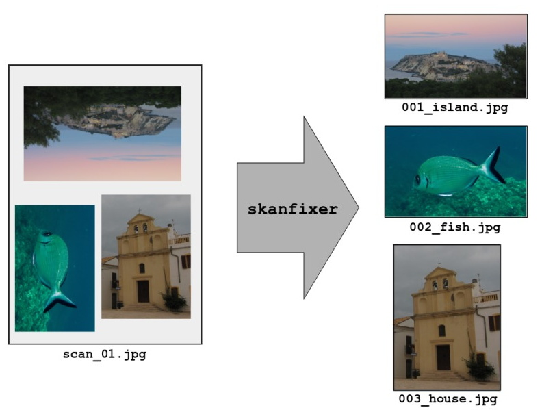

# skanfixer

A program to quickly sort multi-photo scanned images.

Define clip rectangles, with their rotation and label, hit Save and move on to the next picture. Quick and easy.

## Overview



You have a directory with some images, each coming for instance from scanning a pageful of photos or something
and containing several subjects. If you want to save each subject as a separate image, and __do it quickly__,
then skanfixer is the right tool.

skanfixer lets you browse all pictures in a given folder, define a number of clip-rectangles in each picture,
optionally assign a rotation angle and a label to them, and save the contents of each rectangle as a separate image
into a target directory.

## Installation and requirements

To install: clone this repo, make sure you have Python 2.7+ and install the following package:

```
    Pillow==2.6.1
```

## Usage

There are a source directory and a target directory: each can be chosen from the button bar.
To move through the source images use the arrows; for each image you define one or more clip-rectangles
and hit __Save__ to have them exported as stand-alone images in the target directory.

The output filenames features a numeric prefix (whose offset can be configured) and a rectangle label,
if one was specified. The prefix keeps increasing throughout the whole source-dir.

### Defining clip-rectangles

Every time you move away from a given source-image, all defined rectangles are __lost__; so, once all
rectangles are set up, hit Save before advancing to the next picture.

A first click on the picture creates a new rectangle's corner; a second click places the opposite corner.
Rectangles are deleted with a right-click and resized by clicking on their eight size-handles.

The bottom side of the enclosed clip is marked by a thinner internal line: press 'R' when a rectangle is highlighted
to change its orientation (which affects the final saved clip-picture).

A rectangle can have a defining, not necessarily unique, label: to set it, press 'L' when the rectangle is
highlighted, type the label and press 'Enter' to confirm.


### The zoom view

You can turn on and off, at any time, a zoom view, centred on the current mouse position, to perform pixel-sharp
positioning. Press 'Z' to toggle it, or 'Esc' to clear it. The zoom view acts as a portion of the main picture view
in (almost) all respects, so for instance you can move a rectangle's corner through the zoom view, in and out of it,
open the zoom window while moving it, etc.


## Known bugs

None at the moment; please let me know if you find any.

## To do

* A proper configure-settings dialog

* Automatic suggested rectangles upon opening a picture

* Labels should be better placed (i.e. smarter positioning when editing)

* Checkerboard background to mark end of loaded image on edges
